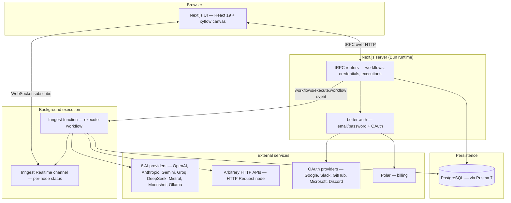
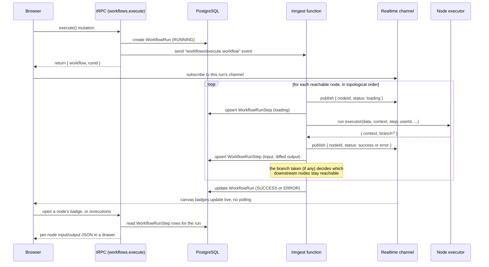
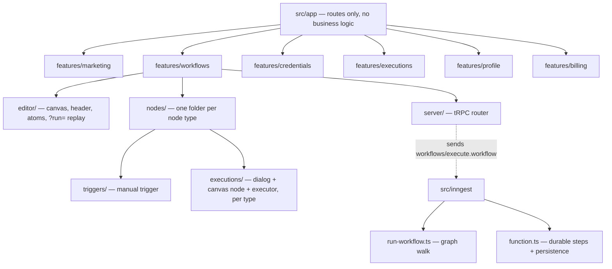
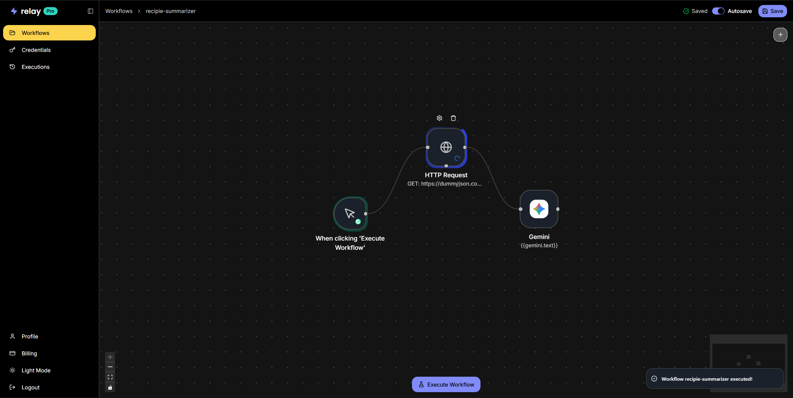
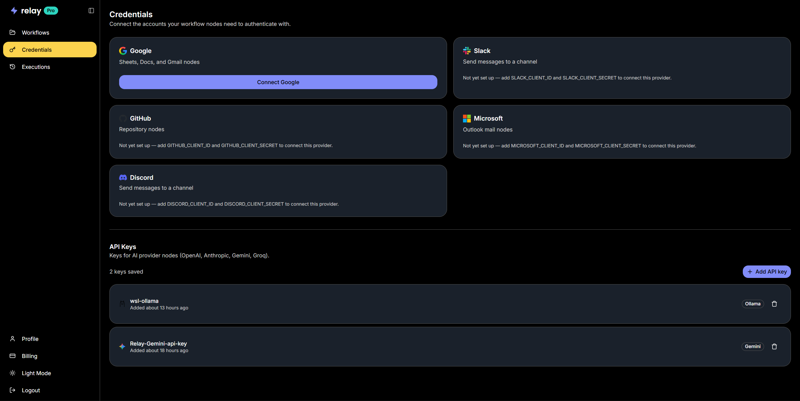
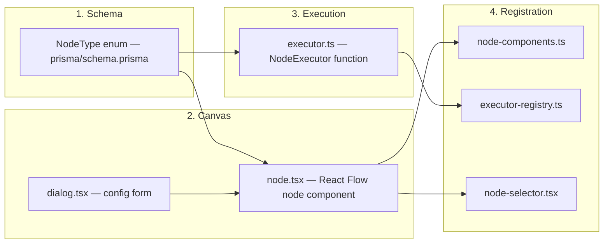

<p align="center">
  
</p>

<h1 align="center">Relay</h1>

<p align="center">
  A visual workflow automation platform — wire up triggers, HTTP calls,<br/>
  conditional branches, and 8 AI providers on a canvas, then watch every node<br/>
  execute live.
</p>

 > Check out the detailed blog post on <a href='https://yashwanth-aravind-portfolio.vercel.app/blog/relay' target ='_blank' >relay</a>

<p align="center">
  
  
  
  
  
  
  <a href="LICENSE"></a>
</p>


## Table of Contents

- [Table of Contents](#table-of-contents)
- [Overview](#overview)
- [Features](#features)
- [Tech Stack](#tech-stack)
- [Architecture](#architecture)
  - [System overview](#system-overview)
  - [Data model](#data-model)
  - [Workflow execution flow](#workflow-execution-flow)
  - [Feature module map](#feature-module-map)
- [Project Structure](#project-structure)
- [Getting Started](#getting-started)
  - [Prerequisites](#prerequisites)
  - [Installation](#installation)
  - [Environment variables](#environment-variables)
  - [Running the app](#running-the-app)
- [Using Relay](#using-relay)
  - [Build a workflow](#build-a-workflow)
  - [Connect credentials](#connect-credentials)
  - [Execute a workflow and watch it live](#execute-a-workflow-and-watch-it-live)
  - [Execution history and replay](#execution-history-and-replay)
- [Node Reference](#node-reference)
- [Adding a New Node](#adding-a-new-node)
- [Testing \& Code Quality](#testing--code-quality)
- [Deployment](#deployment)
- [Contributing](#contributing)
- [License](#license)

## Overview

Relay is a visual, node-based automation tool in the spirit of n8n/Zapier:
you drag nodes onto a canvas, wire them together, and click **Execute
Workflow**. Every node runs for real — it's not a mockup — with live status
badges on the canvas, a full execution history, and a per-node input/output
inspector so you can see exactly what data flowed through your automation.

Under the hood, workflow runs are executed as **durable functions** on
[Inngest](https://www.inngest.com/): each node is its own retryable step,
progress streams back to the browser over a realtime channel, and every
run's input/output is persisted so past runs can be replayed read-only on
the same canvas.

## Features

- **Visual canvas** built on [React Flow](https://reactflow.dev/) (`@xyflow/react`) — drag, connect, and configure nodes with no code.
- **13 node types**: a manual trigger, HTTP Request, IF, Switch, a tool-calling AI Agent, and 8 single-shot AI provider nodes (OpenAI, Anthropic, Gemini, Groq, DeepSeek, Mistral, Moonshot, Ollama).
- **Real conditional branching** — IF/Switch nodes actually prune the downstream graph; a node behind a `False` branch never executes, it isn't just greyed out.
- **`{{path.to.value}}` variable interpolation** in HTTP endpoints/bodies, AI prompts, and IF/Switch conditions, backed by a variable picker that shows the *real* shape of upstream node output (or a sensible fallback before a run exists).
- **Live execution status** on the canvas via `@inngest/realtime` — no polling.
- **Execution history** (`/executions`) — every run and every node's input/output is persisted (size-capped) and independently inspectable.
- **Read-only replay** — reopen any past run's exact canvas state at `?run=<id>` on the same editor, badges and all.
- **Encrypted per-user API keys** for AI providers, plus OAuth account linking (Google, Slack, GitHub, Microsoft, Discord) for future integration nodes — both from `/credentials`.
- **Auth & billing** — email/password and OAuth sign-in via [better-auth](https://www.better-auth.com/), subscriptions via [Polar](https://polar.sh/).

## Tech Stack

| Layer | Technology |
| --- | --- |
| Framework | [Next.js 16](https://nextjs.org/) (App Router, Turbopack, React Compiler), [React 19](https://react.dev/) |
| Language | TypeScript |
| Canvas | [`@xyflow/react`](https://reactflow.dev/) (React Flow) v12 |
| Client state | [Jotai](https://jotai.org/) (editor/canvas), [TanStack Query](https://tanstack.com/query) + [tRPC](https://trpc.io/) (server state), [nuqs](https://nuqs.47ng.com/) (URL state) |
| Forms | [react-hook-form](https://react-hook-form.com/) + [zod](https://zod.dev/) |
| API layer | tRPC 11 (`src/trpc`) |
| Database | PostgreSQL via [Prisma 7](https://www.prisma.io/) (`@prisma/adapter-pg` driver adapter) |
| Background execution | [Inngest](https://www.inngest.com/) durable functions + [`@inngest/realtime`](https://www.inngest.com/docs/features/realtime) for live status |
| Auth | [better-auth](https://www.better-auth.com/) — email/password + Google/Slack/GitHub/Microsoft/Discord OAuth |
| Billing | [Polar](https://polar.sh/) via `@polar-sh/better-auth` |
| AI | [Vercel AI SDK](https://sdk.vercel.ai/) (`ai`) with `@ai-sdk/{openai,anthropic,google,groq,deepseek,mistral,moonshot}` and `ollama-ai-provider-v2` |
| HTTP client | [ky](https://github.com/sindresorhus/ky) |
| Styling / UI | Tailwind CSS v4, Radix UI primitives, shadcn-style components, `next-themes` |
| Monitoring | [Sentry](https://sentry.io/) (`@sentry/nextjs`) |
| Runtime / tooling | [Bun](https://bun.sh/) (package manager, runtime, test runner), [Biome](https://biomejs.dev/) (lint + format), [mprocs](https://github.com/pvolok/mprocs) (multi-process dev) |
| Testing | `bun test` |

## Architecture

### System overview



### Data model

The core Prisma schema (`prisma/schema.prisma`) — auth tables (`User`,
`Session`, `Account`) are omitted for clarity:

```mermaid
erDiagram
    User ||--o{ Workflow : owns
    User ||--o{ Credential : owns
    Workflow ||--o{ Node : contains
    Workflow ||--o{ Connection : contains
    Workflow ||--o{ WorkflowRun : has
    Node ||--o{ Connection : "from / to"
    WorkflowRun ||--o{ WorkflowRunStep : has

    Workflow {
        string id PK
        string name
        string userId FK
    }
    Node {
        string id PK
        string workflowId FK
        NodeType type
        json position
        json data
    }
    Connection {
        string id PK
        string fromNodeId FK
        string toNodeId FK
        string fromOutput "e.g. main, true, false, case-0"
        string toInput
    }
    WorkflowRun {
        string id PK
        string workflowId FK
        RunStatus status "RUNNING | SUCCESS | ERROR"
        datetime startedAt
        datetime completedAt
    }
    WorkflowRunStep {
        string id PK
        string runId FK
        string nodeId
        RunStatus status
        json input "context snapshot before this node ran"
        json output "keys this node added, diffed"
    }
    Credential {
        string id PK
        string userId FK
        CredentialType type
        string value "encrypted at rest"
    }
```



### Workflow execution flow

Clicking **Execute Workflow** kicks off a durable Inngest function that
walks the graph in topological order, one node at a time:



Two things worth calling out from `src/inngest/run-workflow.ts`:

- **Branch pruning is structural, not cosmetic.** An IF/Switch executor
  returns a `branch` (e.g. `"true"`), and only connections leaving that
  exact output handle mark their target node as reachable — everything
  downstream of the untaken branch is skipped outright.
- **Status/history writes are best-effort and never mask a real failure.**
  Publishing a realtime status or recording a `WorkflowRunStep` can itself
  throw; those failures are swallowed so the run's actual success/error
  outcome is always what the executor produced, never a bookkeeping
  artifact.

### Feature module map



## Project Structure

```
relay/
├── prisma/
│   └── schema.prisma          # User, Workflow, Node, Connection, WorkflowRun(Step), Credential
├── src/
│   ├── app/                   # Next.js App Router — routes and layouts only
│   │   ├── (auth)/            # /login, /signup
│   │   ├── (dashboard)/
│   │   │   ├── (editor)/workflows/[workflowID]/   # the canvas
│   │   │   └── (others)/      # /workflows, /executions, /credentials, /profile, /billing
│   │   └── api/                # /api/auth, /api/inngest, /api/trpc
│   ├── features/               # one folder per business domain
│   │   ├── workflows/
│   │   │   ├── editor/         # canvas shell, header, Jotai atoms, replay mode
│   │   │   ├── nodes/          # every node type lives here (see below)
│   │   │   └── server/         # tRPC router: create/save/execute/list workflows
│   │   ├── executions/         # /executions list + run detail (tRPC + components)
│   │   ├── credentials/        # encrypted API keys + OAuth account linking
│   │   ├── marketing/          # public landing page
│   │   ├── profile/            # account settings, sessions
│   │   └── billing/            # Polar subscription status
│   ├── inngest/                 # the durable execution engine
│   │   ├── function.ts          # the execute-workflow Inngest function
│   │   ├── run-workflow.ts      # pure graph-walk: topo sort + branch pruning
│   │   ├── channels/            # Realtime channel definitions
│   │   └── lib/diff-context.ts  # computes a node's output diff for persistence
│   ├── trpc/                    # tRPC client/server plumbing + router registry
│   ├── lib/                     # auth.ts (better-auth), db.ts (Prisma), encryption.ts
│   └── components/ui/           # shared shadcn-style UI primitives
└── screenshots/                 # images used in this README
```

Each node type follows the same three-file shape — see
[Adding a New Node](#adding-a-new-node):

```
src/features/workflows/nodes/executions/components/<node-type>/
├── node.tsx        # React Flow canvas node (icon, label, status badge)
├── dialog.tsx       # configuration form opened by double-clicking the node
└── executor.ts       # server-side NodeExecutor run by the Inngest function
```

## Getting Started

### Prerequisites

- [Bun](https://bun.sh/) 1.x (runtime, package manager, and test runner)
- A PostgreSQL database (local, Docker, or hosted)
- (Optional) [Ollama](https://ollama.com/) running locally if you want to use the Ollama node without a cloud key

### Installation

```bash
git clone git@github.com:yash27007/relay.git
cd relay
bun install
```

### Environment variables

Copy the template and fill in what you need:

```bash
cp .env.example .env
```

| Variable | Required | Purpose |
| --- | --- | --- |
| `DATABASE_URL` | ✅ | PostgreSQL connection string, read by Prisma. |
| `BETTER_AUTH_SECRET` | ✅ | Random secret better-auth uses to sign sessions. |
| `BETTER_AUTH_URL` | ✅ | The app's own base URL (e.g. `http://localhost:3000`). |
| `ENCRYPTION_KEY` | ✅ | Encrypts/decrypts stored `Credential.value` rows (`src/lib/encryption.ts`). The app throws at startup without it. |
| `GOOGLE_CLIENT_ID` / `GOOGLE_CLIENT_SECRET` | optional | Enables Google account linking on `/credentials`. |
| `SLACK_CLIENT_ID` / `SLACK_CLIENT_SECRET` | optional | Enables Slack account linking. |
| `GITHUB_CLIENT_ID` / `GITHUB_CLIENT_SECRET` | optional | Enables GitHub account linking. |
| `MICROSOFT_CLIENT_ID` / `MICROSOFT_CLIENT_SECRET` | optional | Enables Microsoft account linking. |
| `DISCORD_CLIENT_ID` / `DISCORD_CLIENT_SECRET` | optional | Enables Discord account linking. |
| `POLAR_ACCESS_TOKEN` / `POLAR_WEBHOOK_SECRET` / `POLAR_SUCCESS_URL` | optional | Powers the `/billing` page and checkout flow. |
| `SENTRY_AUTH_TOKEN` | optional | Uploads source maps on build; unrelated to running the app. |

Each social provider in the table above only appears on `/credentials` once
**both** of its env vars are set — the app boots fine with none configured.

> **AI provider keys (OpenAI, Anthropic, Gemini, Groq, DeepSeek, Mistral,
> Moonshot, Ollama) are not env vars.** Every user adds their own key from
> the `/credentials` page at runtime; it's encrypted with `ENCRYPTION_KEY`
> and looked up per-workflow-run, scoped to that user. There's nothing to
> pre-configure for AI nodes to work.

### Running the app

Apply the schema to your database, then start Next.js and Inngest's local
dev server together:

```bash
bun generate        # generate the Prisma client
bun migrate:dev      # apply migrations
bun dev:all           # runs `next dev` + `inngest-cli dev` together (via mprocs)
```

`bun dev:all` is a thin wrapper (`mprocs.yaml`) around two processes; you can
also run them in separate terminals:

```bash
bun dev            # Next.js on http://localhost:3000
bun inngest-cli     # Inngest dev server on http://localhost:8288
```

The Inngest dev server is where you watch a run's durable steps, retries,
and payloads — useful when debugging an executor:


Other useful scripts (see `package.json`):

| Script | What it does |
| --- | --- |
| `bun test` | Run the test suite |
| `bun lint` | `biome check` |
| `bun format` | `biome format --write` |
| `bun studio` | Open Prisma Studio against `DATABASE_URL` |
| `bun reset:db` | Drop and re-apply all migrations (destructive, dev only) |

## Using Relay

### Build a workflow

Every workflow starts empty on `/workflows` — create one, then use the
**+** button on the canvas to add nodes from the Triggers/Actions palette:




Double-click a node to configure it. Any field that accepts a
`{{path.to.value}}` expression (HTTP endpoint/body, AI prompts, IF/Switch
conditions) has a variable picker listing the real fields available from
upstream nodes.

### Connect credentials

Add an AI provider API key or link an OAuth account from `/credentials`.
Keys are encrypted at rest and scoped to your user — an executor can only
read the key belonging to the workflow's owner.



### Execute a workflow and watch it live

Hit **Execute Workflow**. Each node's status badge updates in real time as
the run reaches it — loading, then success or error — over the Realtime
channel, no polling. Click any completed node's badge to open its input and
output for that run:


### Execution history and replay

`/executions` lists every run across every workflow. Opening a run shows
its full step timeline; opening it from the list navigates to the canvas in
a **read-only replay** (`?run=<id>`) hydrated from that run's real history —
same editor, same node-output drawer, no separate view to maintain.


## Node Reference

| Node | Type | What it does |
| --- | --- | --- |
| Trigger Manually | `MANUAL_TRIGGER` | Starts the run when you click **Execute Workflow**. One per workflow. |
| HTTP Request | `HTTP_REQUEST` | Makes a `GET`/`POST`/`PUT`/`PATCH`/`DELETE` request; endpoint and body support `{{...}}` templates. |
| IF | `IF` | Evaluates a single condition, routes to a `true` or `false` output — the untaken branch never executes. |
| Switch | `SWITCH` | Routes to whichever case matches, like a multi-way IF. |
| AI Agent | `AGENT` | A multi-step, tool-calling agent that can invoke other nodes (e.g. an HTTP Request) as tools mid-conversation. |
| OpenAI / Anthropic / Gemini / Groq / DeepSeek / Mistral / Moonshot / Ollama | `OPENAI`, `ANTHROPIC`, `GEMINI`, `GROQ`, `DEEPSEEK`, `MISTRAL`, `MOONSHOT`, `OLLAMA` | Single-shot text generation against that provider, using your saved credential and chosen model/temperature/max-tokens/JSON-mode. |

## Adding a New Node

Every node type is the same four pieces wired into the same three registries.
Using `HTTP_REQUEST` as the reference implementation
(`src/features/workflows/nodes/executions/components/http-request/`):



1. **Add the enum value.** In `prisma/schema.prisma`, add your type to
   `enum NodeType`, then run `bun migrate:dev` to generate and apply the
   migration. `bun generate` regenerates the Prisma client's types.

2. **Write the executor.** Create
   `src/features/workflows/nodes/executions/components/<your-node>/executor.ts`
   exporting a `NodeExecutor<TData>` (the type lives in
   `src/features/workflows/nodes/executions/types.ts`):

   ```ts
   import { NonRetriableError } from "inngest";
   import type { NodeExecutor } from "../../types";

   export type YourNodeData = {
     variableName?: string;
     // ...whatever your config form collects
   };

   export const YourNodeExecutor: NodeExecutor<YourNodeData> = async ({
     data,
     nodeId,
     context,
     step,
     userId,
   }) => {
     if (!data.variableName) {
       throw new NonRetriableError("Your Node: Variable name is required");
     }

     const result = await step.run(`your-node-${nodeId}`, async () => {
       // do the actual work here — call an API, read a credential, etc.
       return { ok: true };
     });

     // Merge your result into the context under the user-chosen key, the
     // same convention every existing node follows so downstream nodes can
     // reference it as {{yourVariableName.ok}}.
     return { context: { ...context, [data.variableName]: result } };
   };
   ```

   Throw `NonRetriableError` for a bad configuration (nothing will fix
   itself on retry); a plain `Error` retries automatically under Inngest.
   Wrap any real work in `step.run(...)` so it's checkpointed independently.

3. **Build the canvas node and its config dialog.** Add
   `node.tsx` (a React Flow node — see any existing `*-node.tsx` for the
   shared `BaseNode` wrapper that gives you the status badge for free) and
   `dialog.tsx` (a `react-hook-form` + `zod` form; wire in `VariablePicker`
   for any field that should accept `{{...}}` templates).

4. **Register in all three places:**
   - `src/features/workflows/nodes/node-components.ts` — add
     `[NodeType.YOUR_NODE]: YourNode` to `nodeComponents` so the canvas
     knows how to render it.
   - `src/inngest/lib/executor-registry.ts` — add
     `[NodeType.YOUR_NODE]: YourNodeExecutor` to `executorRegistry` so a run
     knows how to execute it.
   - `src/features/workflows/nodes/node-selector.tsx` — add an entry to
     `executionNodes` (or `triggerNodes`) so it's addable from the **+**
     palette.

5. **Test the executor.** Every existing executor has a
   `executor.test.ts` beside it (e.g. `switch/executor.test.ts`,
   `if/executor.test.ts`) — follow the same pattern: call the executor with
   a fake `step` (`{ run: (_name, fn) => fn() }`) and assert on the
   returned `context`/`branch`.

## Testing & Code Quality

```bash
bun test               # run the full suite (bun test)
bunx tsc --noEmit        # type-check
bun lint                 # biome check (lint)
bun format               # biome format --write
```

This repo unit-tests pure logic — executors, `run-workflow.ts`'s graph
walk, template resolution, encryption — not tRPC routers or presentational
React components, following the existing test files under `src/` as the
convention to match. Colocate a new test as `<file>.test.ts` next to the
code it covers.

## Deployment

There's no bundled Dockerfile or CI pipeline yet — this is a standard
Next.js 16 app with two things to run beyond `next start`:

- **The Next.js app itself** — deployable anywhere Next.js runs (the
  Sentry config's `tunnelRoute` and `automaticVercelMonitors` options are
  Vercel-oriented but not required).
- **The Inngest function** (`src/app/api/inngest/route.ts`) — for
  production, register your deployed `/api/inngest` endpoint with
  [Inngest Cloud](https://www.inngest.com/) (or self-host Inngest) instead
  of running `inngest-cli dev` locally.

You'll also need a reachable PostgreSQL instance with migrations applied
(`bunx prisma migrate deploy`) and the required environment variables from
[Environment variables](#environment-variables) set in your hosting
provider.

## Contributing

1. **Fork and branch.** Branch off `main` with a descriptive name (e.g.
   `feat/slack-node`, `fix/switch-else-branch`).
2. **Follow the existing structure.** New business logic goes under
   `src/features/<domain>/`; new node types follow the four-piece shape in
   [Adding a New Node](#adding-a-new-node). Keep files focused — split a
   file that's grown to do too much rather than growing it further.
3. **Write tests for logic, not components.** Match the convention in
   [Testing & Code Quality](#testing--code-quality).
4. **Before opening a PR**, make sure all of these are clean:

   ```bash
   bun test
   bunx tsc --noEmit
   bun lint
   ```

5. **Commit messages**: short, imperative summary line (`fix: ...`,
   `feat: ...`, `docs: ...`); explain *why* in the body when the change
   isn't self-evident from the diff.
6. **Open a PR against `main`** describing what changed and why. Screenshots
   or a short clip are appreciated for anything UI-visible.

Bug reports and feature requests are welcome via GitHub Issues — include
repro steps for bugs, and the problem you're solving (not just the
solution you have in mind) for feature requests.

## License

Licensed under the [GNU Affero General Public License v3.0](LICENSE)
(AGPL-3.0). In short: you're free to use, modify, and distribute this
project, but if you run a modified version as a network service, you must
make that modified source available to its users too — see [LICENSE](LICENSE)
for the full terms.
